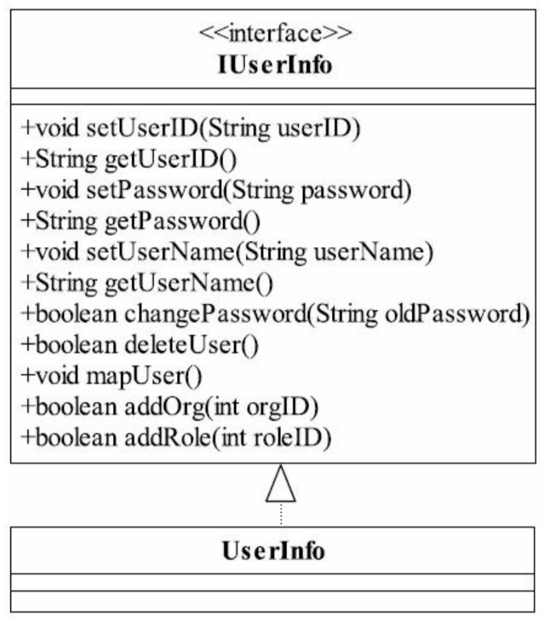

* 参考设计模式之蝉

## 一、单一职责原则

SRP原则（Single Responsibility Principle）

接口或类的设计原则

举个例子：一般项目RBAC模型（Role-Based Access Control）基于角色的访问控制， 用户主体和用户行为应该分离设计]

没有使用SRP原则的IUserInfo接口太糟糕，如下：

使用SRP原则，将用户属性和用户行为分开如下：

